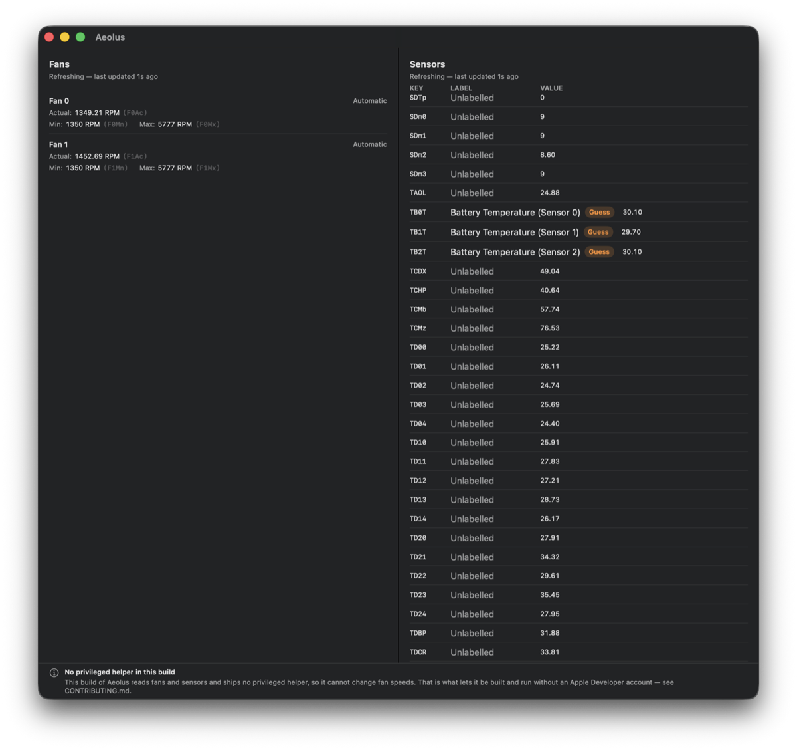
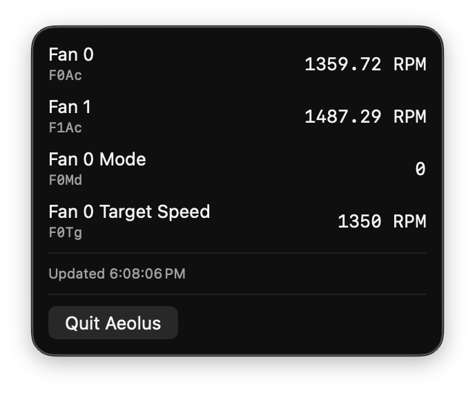
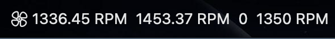

# Aeolus

Free, open-source macOS fan control and thermal monitoring for Apple Silicon and Intel
Macs.

[](https://github.com/blamechris/Aeolus/actions/workflows/ci.yml)
[](LICENSE)

Aeolus watches your Mac's temperature sensors and, when you ask it to, will take over the
fans — a fixed speed, or a curve that follows whichever sensors you care about. The
monitoring half of that works today, from the menu bar or from the command line. The
control half is in development, gated behind the safety subsystem — see the
[roadmap](#roadmap).

> **Status: monitoring works; fan control does not exist yet.** There is no release and no
> binary. The `Monitor` build and `fanctl`'s read commands read real sensors on real
> hardware — reading is the only thing that works. Nothing writes to a fan: the privileged
> helper exists and can be installed
> in `Full` builds, but it is read-only — its write path refuses by design, and a tripwire
> test ([`WritePathAbsenceTests`](Tests/AeolusHelperTests/WritePathAbsenceTests.swift))
> asserts against the source tree that no write path exists. The
> [issue board](https://github.com/blamechris/Aeolus/issues) is the honest picture of
> where things stand.



*The `Monitor` build showing live readouts of real SMC data, captured from an
`origin/main` build on an M4 Max. Unmapped sensors say `Unlabelled`, and a guessed label
wears a `Guess` badge — the catalog never dresses a guess up as a fact.*





*Menu bar readouts — several at once, each with its raw SMC key visible in the panel.*

## Why this exists

The best-known tool in this space is [Macs Fan Control](https://crystalidea.com/macs-fan-control),
and it is genuinely good software. Two things about it prompted this project:

1. **Presets are a paid feature.** Switching between "quiet" and "rendering" is the single
   most useful thing fan control does, and it sits behind a licence. Here it is just part
   of the app.
2. **Two-point curves.** You get a minimum temperature, a maximum temperature, and a
   straight line between them. That is enough for a lot of machines and not enough for
   the rest.

Aeolus aims at parity first and then past it: N-point curves, sensor groups so a fan can
follow `max(CPU, GPU, SSD)` instead of one sensor, profiles that switch themselves on
when you unplug or open Blender, and a real CLI for headless machines.

This project is an independent alternative. It is not affiliated with, derived from, or
endorsed by crystalidea, and no part of Macs Fan Control has been decompiled, inspected,
or copied in building it. See [CONTRIBUTING.md](CONTRIBUTING.md) for the clean-room rules
contributors are held to.

## Quick start

There is no release yet, so everything is built from source. The libraries, the CLI, and
the tests need only a Swift toolchain; the app additionally needs Xcode 16+ and
[XcodeGen](https://github.com/yonaskolb/XcodeGen) (`brew install xcodegen`).

```bash
git clone https://github.com/blamechris/Aeolus.git
cd Aeolus

# Libraries, CLI, helper, and the test suite — no Xcode project needed
swift build && swift test

# Read your Mac's fans and sensors from the terminal — no helper, no privileges
swift run fanctl list
swift run fanctl sensors

# The app — no Apple Developer account required
xcodegen generate && open Aeolus.xcodeproj
```

In Xcode, pick the **Aeolus (Monitor)** scheme. It builds and runs with no certificate at
all. Only the privileged helper that will eventually write to the fans needs a paid
Developer ID — a platform requirement, not a choice — and
[CONTRIBUTING.md](CONTRIBUTING.md) explains how the project is arranged so that this
blocks as little as possible.

## What works today

- **Live fan readouts** — actual, minimum, and maximum RPM per fan, with the raw SMC key
  (`F0Ac`, `F0Mn`, …) always visible next to the value.
- **Live sensor readouts** — every readable SMC key, decoded and continuously refreshed.
  A sensor that fails to read is omitted, never served as zero.
- **Honest sensor naming** — friendly names come from a
  [community catalog](docs/CATALOG.md) with per-entry confidence: a guessed label wears a
  `Guess` badge, and an unmapped key says `Unlabelled` rather than pretending.
- **Menu bar readouts** — several at once, updating live.
- **`fanctl`** — `list`, `sensors`, `watch`, and `dump`, each with `--json` output for
  scripting. All four read directly through `SMCCore`, so they work with no helper
  installed, no signing, and no privileges. [docs/CLI.md](docs/CLI.md) is the command
  reference.
- **A read-only privileged helper** — the XPC boundary is real and enforced: every client
  is checked against a code-signing requirement, protocol versions are negotiated at
  connect time, and every request that would need a write refuses by design.

Everything else — including the fan control in the project's name — is planned, not
shipped. The roadmap below says which is which.

## Roadmap

Work is tracked on five GitHub milestones. [docs/DESIGN.md](docs/DESIGN.md) §10 has the
epic-by-epic plan behind them; the
[issue board](https://github.com/blamechris/Aeolus/issues) has the live detail.

| Milestone | What it covers | Where it stands |
|---|---|---|
| [M0 — Bootstrap](https://github.com/blamechris/Aeolus/milestone/1) | Repository, governance, decisions, CI — no functional code | Complete |
| [M1 — Monitor-only](https://github.com/blamechris/Aeolus/milestone/2) | Reading sensors and fan speeds; shippable and zero risk | In progress — this is the part that works today |
| [M2 — Parity](https://github.com/blamechris/Aeolus/milestone/3) | The write path, gated on the safety subsystem; feature parity with existing tools | Started read-only — the helper and XPC boundary exist; the safety subsystem must land before any write does |
| [M3 — Beyond parity](https://github.com/blamechris/Aeolus/milestone/4) | Curve engine, profile automation, history and export | Not started |
| [M4 — Ship](https://github.com/blamechris/Aeolus/milestone/5) | Signing, notarisation, distribution, a verifiable uninstaller | Not started |

### What it will do

**Parity**

- Per-fan automatic or manual control, at a fixed speed or following a sensor
- Named presets with one-click switching
- Settings that survive a reboot and reapply at login
- Fans returned to Apple's control whenever the app quits — every time, including crashes
- Third-party drive temperatures over S.M.A.R.T.

**Beyond parity**

- Multi-point fan curves with a drag-handle editor, hysteresis, and ramp limiting
- Sensor groups, so cooling the CPU cannot quietly cook the SSD
- Profiles that activate on AC/battery, lid state, external display, or a running process
- Sensor history with CSV/JSON export — not just what the temperature is right now
- Throttle detection, so you can answer "am I actually being throttled?"
- `fanctl` write commands for scripting, SSH, and headless Mac minis
- An optional localhost metrics endpoint for homelab dashboards, off by default

### What it will not do

Filing these as bugs will get you a polite link back here:

- **Undervolting, CPU power limits, or battery charge limiting.** Different problem,
  different risks. [AlDente](https://apphousekitchen.com) covers the charging side.
- **Kernel extensions.** Not now, not later.
- **Windows or Boot Camp.**
- **Defeating Apple's thermal limits or throttling.** Aeolus can make your fans work
  harder. It cannot and will not make your Mac ignore its own safety limits.
- **Anything requiring SIP to be disabled.**

## Safety

Fan control software can damage hardware. Fan control has not shipped yet — nothing
writes to a fan today — but Aeolus is designed so that when the write path ships, the
obvious way to cause that damage is unavailable:

- **Manual control is a lease, not a setting.** Whatever holds the fans has to keep
  saying so. If the app crashes, hangs, or is killed, the fans go back to automatic
  within seconds. Setting your fans low for silence and then forgetting about it while a
  two-hour render runs is not a state this software can be left in.
- **The firmware's limits win.** Speeds are clamped to the range the hardware reports.
  A configuration file cannot widen that range, and no fan can be stopped.
- **There is a ceiling you cannot raise.** Above a compiled-in temperature the fan is
  forced to maximum regardless of your curve. That limit can be lowered, never raised.
- **Sleep, wake, logout, shutdown, and uninstall all restore automatic control.**

[docs/SAFETY.md](docs/SAFETY.md) describes each mechanism and how it is tested.
[docs/RECOVERY.md](docs/RECOVERY.md) is the "my fans are stuck and the app will not
launch" document.

### Disclaimer

This software controls cooling hardware. Misuse — or a bug — can cause overheating,
thermal throttling, or permanent damage to your Mac. It is provided **without warranty of
any kind**, as set out in the [GPL-3.0 licence](LICENSE). You are responsible for what
you tell your fans to do.

## Hardware support

Support is claimed only for hardware someone has actually tested. Everything else is
listed as untested, which is not the same as broken — it usually just means nobody with
that Mac has reported back yet.

See [docs/HARDWARE-MATRIX.md](docs/HARDWARE-MATRIX.md), and please
[file a hardware report](https://github.com/blamechris/Aeolus/issues/new?template=hardware-report.yml)
if your Mac is missing. It needs no special setup.

One constraint worth knowing about up front: on Apple Silicon **M3 and newer**, macOS
actively holds the fans and rejects a straightforward request for manual control. There
is a known way around it, but it is fragile — it has to be re-established every time the
machine wakes from sleep. This is the hardest part of the project and the most likely to
behave differently on hardware we have not seen.

## How it's built

- [docs/ARCHITECTURE.md](docs/ARCHITECTURE.md) — the target graph and the privilege
  boundary: two unprivileged clients, one root helper that owns every SMC write, and why
  the control loop lives in the helper rather than the app.
- [docs/DESIGN.md](docs/DESIGN.md) — the full design document: why this is harder than it
  looks, the stack decision, the safety model, feature scope, and the epic plan.
- [docs/SMC-RESEARCH.md](docs/SMC-RESEARCH.md) — SMC key semantics and their sources,
  with community reports kept separate from behaviour verified on real hardware.
- [docs/ADR/](docs/ADR) — the decision records, from the licence to XPC client
  authorisation.
- [CHANGELOG.md](CHANGELOG.md) — what has actually landed. There being no release yet,
  everything sits under *Unreleased*, honestly.

## Contributing

**You do not need an Apple Developer account.** The `Monitor` build — the entire user
interface, every live readout, and the sensor catalog — builds and runs with no
certificate at all:

```bash
xcodegen generate && open Aeolus.xcodeproj
```

Only the privileged helper that writes to the fans needs a paid Developer ID, because
macOS requires the app and its embedded daemon to share a real one. That is a limitation
of the platform, not a choice, and [CONTRIBUTING.md](CONTRIBUTING.md) explains how the
project is arranged around it.

The lowest-friction way to help is a **sensor catalog entry**: telling us that `Tp09` is
the efficiency-core cluster on your particular Mac. That is a JSON edit, it needs no
build, and it is the thing that makes this software readable rather than a wall of
four-character codes. See [docs/CATALOG.md](docs/CATALOG.md) for how.

## Licence

[GPL-3.0-or-later](LICENSE). The reasoning, and the MIT alternative that was considered
and rejected, are in [docs/ADR/0001-license.md](docs/ADR/0001-license.md).

---

[Contributing](CONTRIBUTING.md) · [Security](SECURITY.md) ·
[Code of Conduct](CODE_OF_CONDUCT.md) · [Licence](LICENSE)
